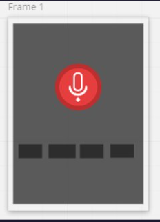

# snoopy-assistant

## Steps to Run it:

**1- clone the repo**
**2- install the Packages :**

```
- datetime
- json
- os
- random
- smtplib
- time
- tkinter
- urllib >> request
- webbrowser
- requests
- speech_recognition
- wikipedia
- PIL >> Image
- gtts gTTS
- playsound
- pygame >> mixer
- twilio.rest >> Client
- ibm_watson >> LanguageTranslatorV3, TextToSpeechV1
- ibm_cloud_sdk_core.authenticators >> IAMAuthenticator
- pyttsx3
```

**3- Run main.py file using PyCharm**

**4- check out the features by clicking on the features button**

**5- start talking with Snoopy by clicking on the Talk button**

**6- use Translator button to translate from language to other**

---

### User Stories

#### Feature One: [Greeting]

- **as a user, I want to ask Snoopy for his name, so he can respond to me with his name**
- **as a user, I want to ask about how is Snoopy doing, so he can respond to me with about his doing**
- **as a user, I want to ask Snoopy to quit or exit, so the program is ended and quits**
- **as a user, I want to know more about Snoopy, so he can respond to me with anything I ask**

#### Feature Two: [Date-Time-Weather]

- **as a user, I want to ask Snoopy about today date, so he can respond to me with today date**
- **as a user, I want to ask Snoopy about time, so he can respond to me now time**
- **as a user, I want to ask Snoopy about today weather, so he can respond to me with weather statue**

#### Feature Three: [Searching]

- **as a user, I want to ask Snoopy to search on google for any topic, so he can respond to me and find what I'm looking for**
- **as a user, I want to ask Snoopy to search on Youtube for any topic, so he can respond to me and find what I'm looking for**
- **as a user, I want to ask Snoopy anything related to search on Wikipedia, so he can respond to me Wikipedia result page**
- **as a user, I want to ask Snoopy to open Facebook, so he can open it for me**
- **as a user, I want to ask Snoopy to open Discord, so he can open it for me**
- **as a user, I want to know the latest news feeds, so he can respond to me with NEWS**
- **as a user, I want to find the location for any place, and find my exact location**

#### Feature Four : [Sender]

- **as a user, I want to ask Snoopy to send an email, so he can do it**
- **as a user, I want to ask Snoopy to send an SMS, so he can do it**

#### Feature Five : [Translator]

- **as a user, I want to speak English and Snoopy can translate and speak to other languages**

#### Feature Six : [Telling]

- **as a user, I want to ask Snoopy to Tell a Joke, so he can respond me a funny Joke**
- **as a user, I want to talk with Snoopy in Arabic, so he can understand me**
- **as a user, I want to ask Snoopy to play a music, so he can play it in background**
- **as a user, I want to ask Snoopy to write a note and show it, so he can do it**

---

### Wireframe



---

### Team Agreement

#### Students Names

---- This is an alphabetical order, contribution is even ----

- Ayman Naif
- Layan Abu Shaweesh
- Obada Alhawjreh
- Niveen AL Smadi

#### Cooperation Plan

**What are the key strengths of each person on the team?**

- Ayman Naif & Niveen Al Smadi: Machine learning and Ai
- Obada Alhawjreh & Layan Abu Shaweesh : Data Analasis and Ai

**How can you best utilize these strengths in the execution of your project?**
Through deeper research and application of new information to the project

**In which professional competencies do you each want to develop greater strength?**
in searching to learn more about Machine learning and Ai

**Knowing that every person in your team needs to understand all aspects of the project, how do you plan to approach the day-to-day work?**
Tasks are distributed to each person and at the end of the day we gather for each person to explain what he has done

#### Conflict Plan

**What will be your group’s process to resolve conflict, when it arises?**

The team leader should take the lead and solve the conflict between team members, maybe he will contact team members in private.

**What will your team do if one person is taking over the project and not letting the other members contribute?**
They will definitely not like it, and they will send a message to the team leader, and then the team leader will handle the matter and will not allow this to happen.

**How will you approach each other and the challenges of the project knowing that it is impossible for all members to be at the exact same place in understanding and skill level?**
We will work on each person's strengths, and then we will support each other so that strengths can pass from one person to another

**How will you raise concerns to members who are not adequately contributing?**

Speak with them in private, understant their behaviour and try to solve any issue.

**How and when will you escalate the conflict if your resolution attempts are unsuccessful?**

When one of the team members cross the borders, by cursing or underestimating other members.

#### Communication Plan

**What hours will you be available to communicate?**
from 9:00 am until 10:00 pm

**What platforms will you use to communicate (ie. Slack, phone …)?**
Slack, Discord and Zoom

**How often will you take breaks?**
3 times, every two hours there's half-hour break

**What is your plan if you start to fall behind?**
We will double the effort and increase the number of working hours in order to complete the time

**How will you communicate after hours and on the weekend?**

We are going to use communication channels, like Discord, Slack, or Zoom.

**What is your strategy for ensuring everyone’s voice is heard?**

Always picking up random members randomly in my team, and ask them for their openion and thoughts.

**How will you ensure that you are creating a safe environment where everyone feels comfortable speaking up?**

By sending memes, telling some jokes, offer a funny environment, so everyone feel safe, like they are between their family members.

#### Work Plan

**How you will identify tasks, assign tasks, know when they are complete, and manage work in general?**

By creating a wireframe, then start by building a workflow, assign tasks for each member, understand each member strench and weak points.

**What project management tool will be used?**

GitHub repository project tool.

#### Git Process

**What components of your project will live on GitHub?**

pyhton files and test files

**How will you share the repository with your teammates?**

By using GitHub organization tool.

**What is your Git flow?**

Creating a branch for Development, then creating a branch from the Dev one, to add feature, then PR and merge to the Dev one.

**Will you be using a PR review workflow? If so, consider:**
**1- How many people must review a PR?**

At least two members, preferable all the members.

**2- Who merges PRs?**

Team leader.

**3- How often will you merge?**

Using GitHub.

**4- How will you communicate that it’s time to merge?**

Slack my team.
