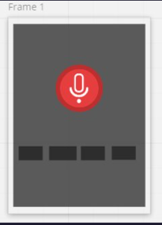

# Requirements

## User Stories

#### Feature One: [Greeting]

- **as a user, I want to ask Snoopy for his name, so he can respond to me with his name**
- **as a user, I want to ask about how is Snoopy doing, so he can respond to me with about his doing**
- **as a user, I want to ask Snoopy to quit or exit, so the program is ended and quits**
- **as a user, I want to know more about Snoopy, so he can respond to me with anything I ask**

#### Feature Two: [Date-Time-Weather]

- **as a user, I want to ask Snoopy about today date, so he can respond to me with today date**
- **as a user, I want to ask Snoopy about time, so he can respond to me now time**
- **as a user, I want to ask Snoopy about today weather, so he can respond to me with weather statue**

#### Feature Three: [Searching]

- **as a user, I want to ask Snoopy to search on google for any topic, so he can respond to me and find what I'm looking for**
- **as a user, I want to ask Snoopy to search on Youtube for any topic, so he can respond to me and find what I'm looking for**
- **as a user, I want to ask Snoopy anything related to search on Wikipedia, so he can respond to me Wikipedia result page**
- **as a user, I want to ask Snoopy to open Facebook, so he can open it for me**
- **as a user, I want to ask Snoopy to open Discord, so he can open it for me**
- **as a user, I want to know the latest news feeds, so he can respond to me with NEWS**
- **as a user, I want to find the location for any place, and find my exact location**

#### Feature Four : [Sender]

- **as a user, I want to ask Snoopy to send an email, so he can do it**
- **as a user, I want to ask Snoopy to send an SMS, so he can do it**

#### Feature Five : [Translator]

- **as a user, I want to speak English and Snoopy can translate and speak to other languages**

#### Feature Six : [Telling]

- **as a user, I want to ask Snoopy to Tell a Joke, so he can respond me a funny Joke**
- **as a user, I want to talk with Snoopy in Arabic, so he can understand me**
- **as a user, I want to ask Snoopy to play a music, so he can play it in background**
- **as a user, I want to ask Snoopy to write a note and show it, so he can do it**

---

### Wireframe

